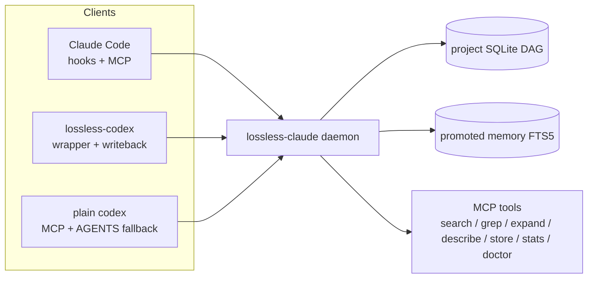
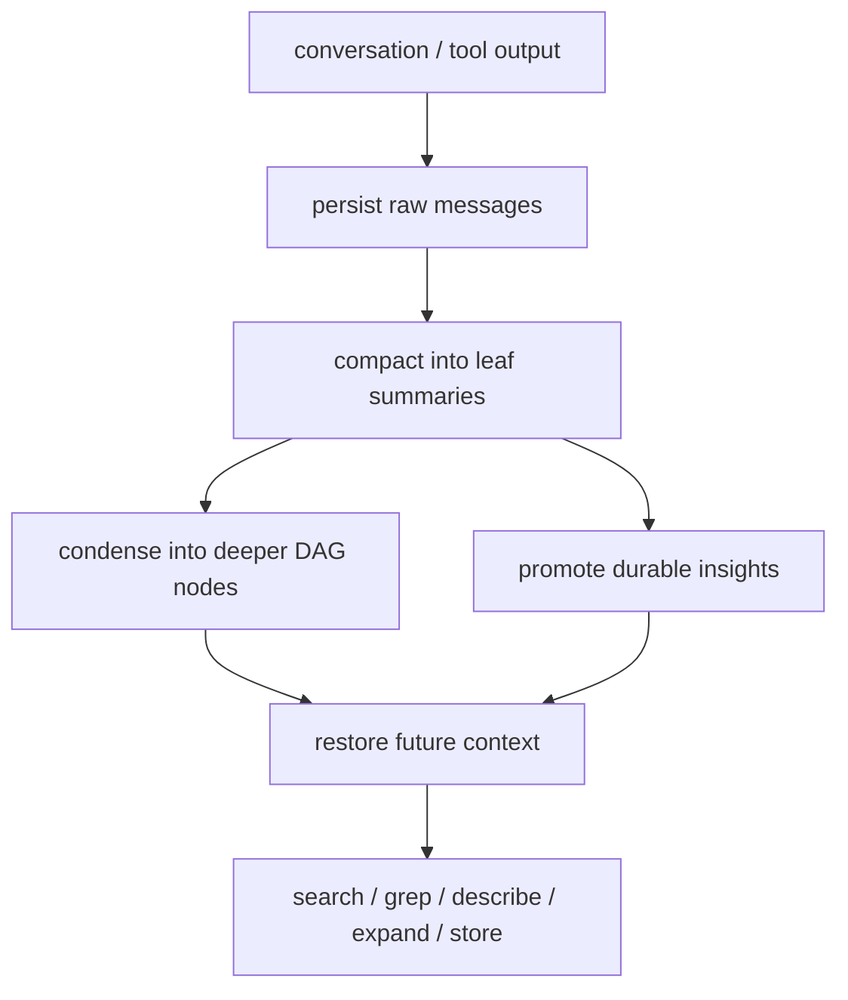
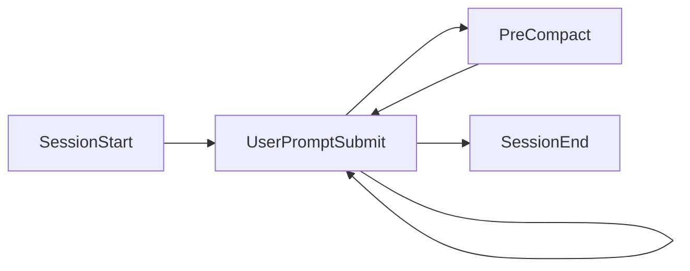

<p align="center">
  <strong>lossless-claude</strong><br>
  Shared memory infrastructure for Claude Code and Codex
</p>

<p align="center">
  DAG-based summarization, SQLite-backed message persistence, promoted long-term memory, MCP retrieval tools
</p>

<p align="center">
  <a href="https://www.npmjs.com/package/@ipedro/lossless-claude"></a>
  <a href="LICENSE"></a>
  <a href="package.json"></a>
  <a href="https://github.com/anthropics/claude-code"></a>
</p>

<p align="center">
  <a href="https://lossless-claude.com">Website</a> &bull;
  <a href="#runtime-model">Runtime Model</a> &bull;
  <a href="#installation">Installation</a> &bull;
  <a href="#codex-fallback-without-the-wrapper">Plain Codex Fallback</a> &bull;
  <a href="#mcp-tools">MCP Tools</a> &bull;
  <a href="#development">Development</a>
</p>

---

`lossless-claude` replaces sliding-window forgetfulness with a persistent memory runtime for both humans and agents.

- Every message is stored in a project SQLite database.
- Older context is compacted into a DAG of summaries instead of being dropped.
- Durable decisions and findings are promoted into cross-session memory.
- Claude Code and Codex can both read and write the same project memory.

Humans and agents use the same backend. The integration surface differs by client, but the memory model is shared.

This repo started as a fork of [lossless-claw](https://github.com/Martian-Engineering/lossless-claude) by [Martian Engineering](https://martian.engineering), adapted for Claude Code and extended to support Codex. The LCM model and DAG architecture originate from the [Voltropy paper](https://papers.voltropy.com/LCM).

## Runtime Model



### Capabilities by integration path

| Path | Restore | Prompt hints | Turn writeback | Automatic compaction | Notes |
|---|---|---|---|---|---|
| Claude Code | Yes | Yes | Yes, via transcript/hooks | Yes | Primary hook-based integration |
| `lossless-codex` | Yes | Yes | Yes, live structured ingestion | Yes | Primary Codex integration |
| Plain `codex` + MCP | Manual | Manual | Manual | Manual | Fallback mode only |

### Why the wrapper exists

`lossless-codex` exists because plain `codex` does not have the same hook path Claude Code has in this repo's integration model.

The wrapper does four things prompt instructions alone cannot guarantee:

1. Restores memory before the turn.
2. Injects prompt-time hints from prior project memory.
3. Captures and normalizes the resulting turn into stored messages.
4. Compacts stored conversation state back into the DAG.

Without the wrapper, Codex can still query and store memory through MCP tools, but memory use becomes manual rather than automatic.

## LCM Model

| Phase | What happens |
|---|---|
| Persist | Raw messages are stored in SQLite per conversation |
| Summarize | Older messages are grouped into leaf summaries |
| Condense | Summaries roll up into higher-level DAG nodes |
| Promote | Durable insights are copied into cross-session memory |
| Restore | New sessions recover context from summaries and promoted memory |
| Recall | Agents query, expand, and inspect memory on demand |

Nothing is dropped. Raw messages remain in the database. Summaries point back to their sources. Promoted memory remains searchable across sessions.



## Installation

### Prerequisites

- Node.js 22+
- Claude Code for hook-based Claude integration
- Codex CLI for `lossless-codex`

### Claude Code

Marketplace:

```bash
claude plugin marketplace add ipedro/xgh-marketplace
claude plugin install lossless-claude
lossless-claude install
```

Standalone:

```bash
claude plugin add github:ipedro/lossless-claude
lossless-claude install
```

`lossless-claude install` writes config, registers hooks, installs slash commands, registers MCP, and verifies the daemon.

### Codex with automatic shared memory

Install the package and the Codex CLI:

```bash
npm install -g @ipedro/lossless-claude
npm install -g @openai/codex
```

Run Codex through the wrapper:

```bash
lossless-codex "Reply only with OK"
```

`lossless-codex` wraps `codex exec`, restores memory before the turn, injects prompt hints, writes the turn back into the project database, and compacts the stored session state after each successful turn.

## Codex Fallback Without The Wrapper

Plain `codex` can still use LCM, but this is advisory fallback mode rather than full automatic shared memory.

### Step 1: register the MCP server

Add this to `~/.codex/config.toml`:

```toml
[mcp_servers.lossless-claude]
command = "lossless-claude"
args = ["mcp"]
```

### Step 2: copy fallback instructions

Project-local:

```bash
cp configs/codex/AGENTS.md ./AGENTS.md
```

Global:

```bash
mkdir -p ~/.codex
cp configs/codex/AGENTS.md ~/.codex/AGENTS.md
```

The fallback prompt lives in [`configs/codex/AGENTS.md`](configs/codex/AGENTS.md).

Restart Codex after registering the MCP server or changing `AGENTS.md`.

### What this gives you

- access to LCM MCP tools from plain `codex`
- prompt-level guidance to search/store memory before claiming context is unavailable
- a usable manual fallback when the wrapper is not being used

### What it does not give you

- automatic restore before each turn
- automatic turn ingestion
- automatic post-turn compaction
- wrapper-level reliability

If you want Claude-like automatic shared memory behavior in Codex, use `lossless-codex`.

## Hooks

Claude Code uses four hooks. All hooks auto-heal: each validates that all required entries remain registered and repairs missing entries before continuing.

| Hook | Command | Purpose |
|---|---|---|
| `PreCompact` | `lossless-claude compact` | Intercepts compaction and writes DAG summaries |
| `SessionStart` | `lossless-claude restore` | Restores project context, recent summaries, and promoted memory |
| `SessionEnd` | `lossless-claude session-end` | Ingests the completed Claude transcript |
| `UserPromptSubmit` | `lossless-claude user-prompt` | Searches memory and injects prompt-time hints |



## MCP Tools

| Tool | Purpose |
|---|---|
| `lcm_search` | Search episodic and promoted knowledge |
| `lcm_grep` | Regex or full-text search across stored history |
| `lcm_expand` | Recover deeper detail from compacted history |
| `lcm_describe` | Inspect a stored summary or file by id |
| `lcm_store` | Persist durable memory manually |
| `lcm_stats` | Inspect memory coverage, DAG depth, and compression |
| `lcm_doctor` | Diagnose daemon, hooks, MCP registration, and summarizer setup |

## CLI

```bash
lossless-claude install                # setup wizard
lossless-claude doctor                 # diagnostics
lossless-claude stats                  # memory and compression overview
lossless-claude stats -v               # per-conversation breakdown
lossless-claude status                 # daemon + summarizer mode
lossless-claude daemon start --detach  # start daemon in background
lossless-claude compact                # PreCompact hook handler
lossless-claude restore                # SessionStart hook handler
lossless-claude session-end            # SessionEnd hook handler
lossless-claude user-prompt            # UserPromptSubmit hook handler
lossless-claude mcp                    # MCP server
lossless-claude -v                     # version
lossless-codex "your prompt"           # Codex wrapper with shared memory
```

## Configuration

All environment variables are optional. The default summarizer mode is `auto`.

| Variable | Default | Description |
|---|---|---|
| `LCM_SUMMARY_PROVIDER` | `auto` | `auto`, `claude-process`, `codex-process`, `anthropic`, `openai`, or `disabled` |
| `LCM_SUMMARY_MODEL` | unset | Optional model override for the selected summarizer provider |
| `LCM_CONTEXT_THRESHOLD` | `0.75` | Context fill ratio that triggers compaction |
| `LCM_FRESH_TAIL_COUNT` | `32` | Most recent raw messages protected from compaction |
| `LCM_LEAF_MIN_FANOUT` | `8` | Minimum raw messages per leaf summary |
| `LCM_CONDENSED_MIN_FANOUT` | `4` | Minimum summaries per condensed node |
| `LCM_INCREMENTAL_MAX_DEPTH` | `0` | Automatic condensation depth |
| `LCM_LEAF_CHUNK_TOKENS` | `20000` | Maximum source tokens per leaf compaction pass |
| `LCM_LEAF_TARGET_TOKENS` | `1200` | Target size for leaf summaries |
| `LCM_CONDENSED_TARGET_TOKENS` | `2000` | Target size for condensed summaries |

`auto` resolves per caller:

- `lossless-claude` -> `claude-process`
- `lossless-codex` -> `codex-process`
- explicit config or `LCM_SUMMARY_PROVIDER` override applies to both

See [`docs/configuration.md`](docs/configuration.md) for tuning notes and deeper operational guidance.

## Development

```bash
npm install
npm run build
npx vitest
npx tsc --noEmit
```

### Repository layout

```text
bin/
  lossless-claude.ts          CLI entry point
  lossless-codex.ts           Codex wrapper entry point
configs/
  codex/AGENTS.md             Plain Codex fallback instructions
src/
  adapters/codex.ts           Codex session runner + JSONL normalization
  compaction.ts               DAG compaction engine
  daemon/                     HTTP daemon, lifecycle, config, routes
  db/                         SQLite schema + promoted memory
  hooks/                      Claude hook handlers + auto-heal
  llm/                        summarizer backends
  mcp/                        MCP server + tool definitions
  store/                      conversation and summary persistence
installer/
  install.ts                  setup wizard
  uninstall.ts                cleanup
test/
  ...                         Vitest suites
```

## Technical Notes

- Claude Code integration is hook-first.
- Codex integration is wrapper-first.
- Plain Codex support is intentionally weaker and documented as fallback mode.
- The daemon is shared; the memory backend is not Claude-specific or Codex-specific.
- The repo still carries the original lossless-claw lineage, but the current runtime is Claude Code + Codex oriented.

## Acknowledgments

`lossless-claude` stands on the shoulders of [lossless-claw](https://github.com/Martian-Engineering/lossless-claude), the original implementation by [Martian Engineering](https://martian.engineering). The DAG-based compaction architecture, the LCM memory model, and the foundational design decisions all originate there.

The underlying theory comes from the [LCM paper](https://papers.voltropy.com/LCM) by [Voltropy](https://x.com/Voltropy).

## License

MIT
